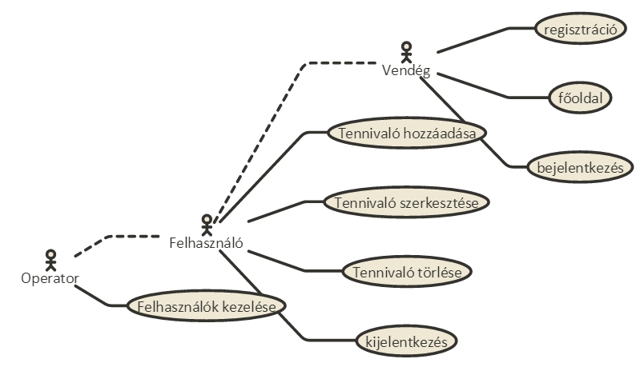
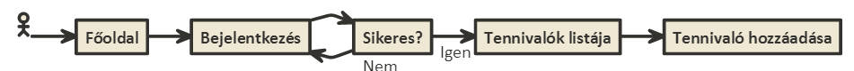
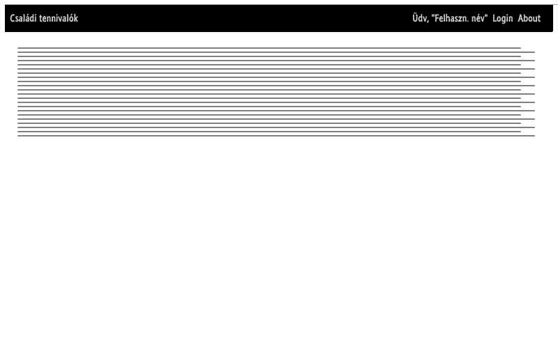
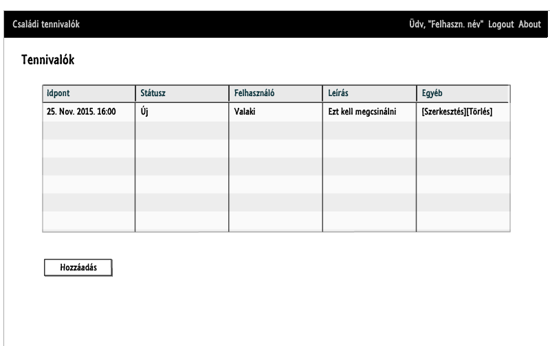
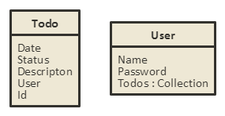

#Családi todo alkalmazás
##Követelményanalízis
###Funkcionális követelmények
* Felhasználóként szeretnék tennivalót hozzáadni --> Új tennivaló
* Felhasználóként szeretném módosítani a tennivalókat --> Szerkesztés, törlés
* Az Operátor tudja kezelni a felhasználókat --> (nem került megvalósításra)

###Nem funkcioniális követelmények
* Felhasználóbarát elrendezés, kinézet
* Egyszerű használat
* Felhasználók adatainak tárolása

###Használatieset-modell
####Szerepkörök
* vendég --> Főoldal, Regisztáció, Bejelentkezés
* felhasználó --> Tennivalók kezelése + Vendég szerepköre
* operátor --> Felhasználó szerepkörén túl a felhasználók kezelése

####Tennivaló hozzáadása

##Tervezés
###Oldaltérkép
* publikus
  * főoldal
  * about
  * login

* felhasználó
  * főoldal
  * about
  * login/logout
  * tennivalók
    * hozzáadás
    * szerkesztés
    * törlés

* operátor
  * főoldal
  * about
  * login/logout
  * tennivalók
    * hozzáadás
    * szerkesztés
    * törlés
  * felhasználók
    * hozzáadás
    * szerkesztés
    * törlés 

###Végpontok
* GET / : Főoldal
* GET /about : Információ
* GET /login : Bejelentkezés
* POST /login : Bejelentkezési adatok felküldése
* GET /login/signup : Regisztráció
* POST /login/signup : Regisztációs adatok felküldése
* GET /todos/list : Tennivalók listája
* GET /todos/new : Új tennivaló hozzáadása
* POST /todos/new : Új tennivaló hozzáadása, adatok küldése
* GET /todos/edit/:id : Tennivaló szerkesztése
* POST /todos/dit/:id : Tennivaló szerkesztése, adatok küldése
* GET /todos/delete/:id : Tennivaló törlése

###Oldalvázlatok

###Modellek

Állapotdiagram
Dinamikus működés
Szekvenciadiagram
Implementáció

Fejlesztői környezet bemutatása
Könyvtárstruktúrában lévő mappák funkiójának bemutatása
Tesztelés

Automatikus tesztek szükségesek. Nem kell teljeskörű tesztelés, a hallgató mutassa meg, hogy képes ilyen tesztek írására.

Tesztelési környezet bemutatása
Egységtesztek: legalább 1 adatmodell tesztelése
Funkcionális felületi tesztek: legalább 1 folyamat tesztelése
VAGY: Selenium IDE használatával
VAGY: zombie.js használatával
Tesztesetek felsorolása: milyen eseteket próbált végig a hallgató
Felhasználói dokumentáció

A futtatáshoz ajánlott hardver-, szoftver konfiguráció
Telepítés lépései: hogyan kerül a Githubról a célgépre a program
A program használata